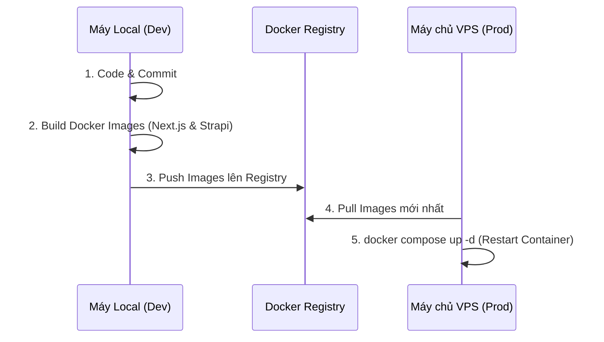

# 🚀 Hướng dẫn Triển khai VPS (Production Deployment)

Tài liệu này hướng dẫn quy trình triển khai LaunchPad CMS lên một máy chủ VPS Production với tiêu chí: **"Zero-Downtime, Zero-Build on VPS"**.

Để đảm bảo máy chủ VPS (thường có cấu hình thấp) hoạt động ổn định nhất, toàn bộ quá trình đóng gói (Build Code) sẽ diễn ra tại máy cá nhân (Local). VPS chỉ làm nhiệm vụ kéo (Pull) Image đã đóng gói về và chạy.

---

## 🏛️ Kiến trúc Triển khai



---

## 💻 Giai đoạn 1: Thao tác tại máy Local

### 1. Build và Push Image lên Registry
Sử dụng công cụ đã được tối ưu hóa trong VS Code để thực hiện tự động cả 2 bước Build và Push:
1. Nhấn `Ctrl + Shift + B`
2. Chọn Task: **`🐳 registry: push-all`**
3. Hệ thống sẽ hỏi:
   - **Registry Address**: Nhập địa chỉ Private Registry của bạn (VD: `103.x.x.x:5000` hoặc `registry.domain.com`).
   - **Image Tag**: Nhập tag phiên bản (Sử dụng mặc định là `latest`, hoặc bạn có thể điền mã phiên bản nếu muốn).

---

## 🌐 Giai đoạn 2: Thao tác tại máy chủ VPS

### 1. Chuẩn bị file `.env`
Sử dụng script để tự động tạo cấu hình bảo mật thay vì làm thủ công:
```bash
chmod +x scripts/copy-env.sh
./scripts/copy-env.sh --env prod . ./strapi
```
*(Script tự động set `COMPOSE_FILE=compose.prod.yml` để bạn không cần gõ flag `-f` khi chạy lệnh Docker Compose)*

Mở file `.env` và kiểm tra thông số Registry:
```env
# Mặc định là localhost:5000 nếu Registry cài trên cùng VPS. 
# Nếu bạn dùng Registry ở máy chủ khác, hãy thay bằng IP/Domain của Registry đó.
REGISTRY_URL=localhost:5000 
IMAGE_TAG=latest 
```

### 2. Triển khai Hệ thống (Pull & Run)
```bash
# Tải các image mới nhất
docker compose pull

# Khởi động lại hệ thống ngầm
docker compose up -d
```

### 3. Tắt chế độ Seed Data (Rất Quan Trọng)
Nếu biến `SEED_DATA=true` đang bật, hệ thống sẽ reset lại Database mỗi khi khởi động lại. Sau lần chạy đầu tiên thành công, bạn **BẮT BUỘC** phải tắt nó đi:
```bash
chmod +x scripts/toggle-seed.sh
./scripts/toggle-seed.sh disable
```

---

## 🔄 Quy trình Cập nhật & Rollback

Mỗi khi bạn sửa code và muốn đẩy lên VPS:

1. **Local:** Build và Push lên Registry.
2. **VPS:** Nếu dùng tag khác, sửa `IMAGE_TAG` trong `.env`. Nếu dùng `latest` thì giữ nguyên.
3. **VPS:** Chạy lệnh cập nhật:
   ```bash
   docker compose pull
   docker compose up -d
   ```

**🚑 Rollback (Khi bản update bị lỗi):**
Chỉ cần mở file `.env` trên VPS, đổi `IMAGE_TAG` về phiên bản cũ, và chạy lại lệnh Pull + Up. Hệ thống sẽ lập tức quay về trạng thái an toàn!

---

## ⚙️ Cấu hình Nginx Proxy (Dành cho LaunchPad Registry Stack)

*(Lưu ý: Bỏ qua phần này nếu bạn không cài đặt Nginx UI từ hệ sinh thái LaunchPad Registry Stack).*

Thay vì chiếm dụng cổng `80` và `443`, container Nginx của CMS sẽ đẩy website ra cổng `8000` để nhường quyền quản lý SSL cho **Nginx UI**.

**Cách trỏ Tên miền (Domain) vào hệ thống:**
1. Đăng nhập vào **Nginx UI** trên VPS.
2. Thêm một **Site** mới với thông số:
   - **Server Name:** `cms.yourdomain.com`
   - **Listen:** `80`
3. Trong phần **Locations**, tạo Proxy chuyển tiếp về cổng nội bộ:
   - **Path:** `/`
   - **Proxy Pass:** `http://127.0.0.1:8000`
   - **Host:** Bật "Preserve Host" (`$host`).
4. Chuyển sang tab **SSL**, chọn **Enable SSL** (Let's Encrypt), điền Email và bấm **Issue** để tự động cấp chứng chỉ HTTPS.

---

## 🛠️ Xử lý sự cố thường gặp (Troubleshooting)

> [!WARNING]  
> Cảnh báo: Các lệnh dọn dẹp dưới đây là biện pháp mạnh để giải phóng ổ cứng. Chỉ thực hiện khi VPS báo lỗi Full Disk (Không pull/build được ảnh).

### Tràn dung lượng ổ cứng (No space left on device)
Trong quá trình Push/Pull cập nhật nhiều lần, Docker sẽ giữ lại các phiên bản cũ gây ra "rác" (Dangling Images, Build Cache) chiếm hàng chục GB ổ cứng. 

**Giải pháp:** Chạy script dọn dẹp (Lệnh này an toàn với các Container đang chạy, nó chỉ dọn rác và các container đã dừng):
```bash
sh scripts/cleanup.sh
```
