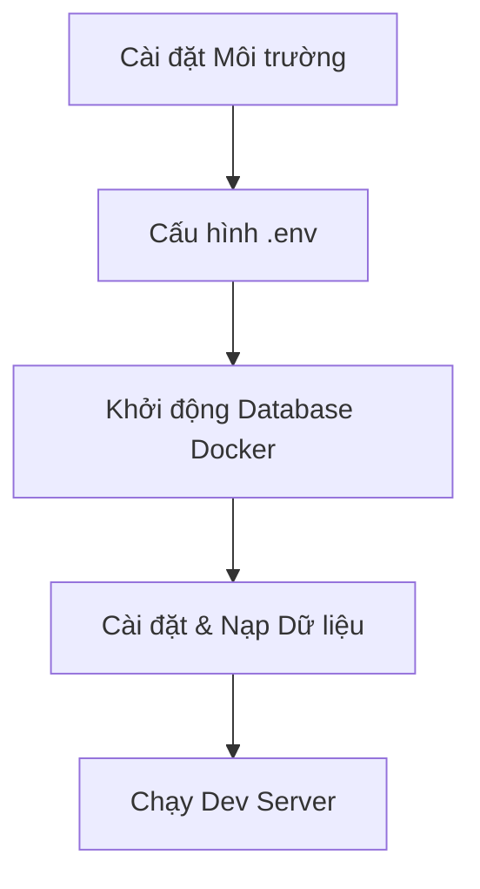

# 💻 Workflow 1: Development (Quy trình Phát triển Local)

Tài liệu này chuẩn hóa quy trình phát triển dự án LaunchPad CMS trên máy cá nhân (Local). Quy trình này được thiết kế để tối ưu hóa tốc độ code (Hot Reload) bằng cách chạy Next.js và Strapi trực tiếp trên NodeJS, đồng thời dùng Docker để chạy PostgreSQL Database nhằm đảm bảo tính cô lập.

---

## 🎯 Tổng quan Quy trình (The Workflow)



---

## 🛠️ Bước 1: Chuẩn bị Môi trường

Đảm bảo máy tính của bạn đã được cài đặt:
- **Node.js**: Phiên bản 20.x hoặc 22.x (LTS)
- **Yarn**: (Đã được bật sẵn qua Corepack trong dự án)
- **Docker Desktop**: Dùng để chạy Database nhanh chóng.

---

## ⚙️ Bước 2: Cấu hình Biến môi trường

1. Copy file mẫu `.env.example` thành `.env`:
   ```bash
   cp .env.example .env
   ```
2. Kiểm tra và giữ nguyên các thông số mặc định nếu bạn chỉ phát triển ở Local. Các thông số quan trọng:
   - `DATABASE_HOST=localhost` (khi chạy Strapi bên ngoài Docker)
   - `DATABASE_PORT=54321` (Map port mặc định từ Docker ra Host)

---

## 🗄️ Bước 3: Khởi động Database

Thay vì phải cài PostgreSQL lằng nhằng lên máy thật, chúng ta dùng Docker:

```bash
# Lệnh này tải và chạy riêng container Database ở chế độ ngầm
docker compose up -d launchpad-db
```
*💡 Mẹo: Database sẽ được map ra cổng `54321` trên máy bạn. Dữ liệu được lưu trữ an toàn trong Docker Volume `strapi-data`.*

---

## 📦 Bước 4: Cài đặt Dependencies & Seed Dữ liệu

Chạy lệnh tự động hóa cài đặt toàn bộ dependencies cho Next.js và Strapi:

```bash
yarn install
```

**(Tùy chọn) Nạp dữ liệu mẫu:** Nếu đây là lần đầu chạy, bạn nên nạp dữ liệu mẫu để có sẵn bài viết, cấu hình SEO:
```bash
yarn seed
```
*Lưu ý: Quá trình seed sẽ xóa trắng DB hiện tại và nạp lại từ file backup.*

---

## 🚀 Bước 5: Khởi động Development Server

Dự án sử dụng **Turborepo** để chạy đồng thời cả Backend và Frontend. Có 2 cách để khởi động:

### Cách 1: Sử dụng Command Line (Khuyên dùng)
```bash
yarn dev
```
Lệnh này sẽ gọi đồng thời:
- Strapi (Cổng `1337`)
- Next.js (Cổng `3000`)

### Cách 2: Sử dụng VS Code Tasks
Nhấn `Ctrl + Shift + B` và chọn **`🚀 cms: dev`**.

---

## 🐳 Phụ lục: Chạy Full-Stack bằng Docker (Testing Mode)

Nếu bạn muốn kiểm tra xem dự án chạy trên Docker có hoạt động giống hệt Production hay không trước khi đẩy lên VPS, hãy dùng lệnh:

```bash
# Build và chạy toàn bộ bằng Docker (Next.js, Strapi, Nginx, DB)
docker compose up -d --build
```
- Khi chạy Full Docker, URL kết nối API nội bộ (như Next.js gọi Strapi) tự động dùng `http://strapi:1337`.
- Tính năng `Output File Tracing` của Next.js sẽ được kích hoạt để sinh ra bản Build `standalone` siêu nhẹ.
- Để tắt: `docker compose down`

---

## 🚨 Khắc phục Sự cố Thường gặp

1. **Lỗi `ECONNREFUSED` trên Next.js khi dùng Docker**: Do Next.js khởi động nhanh hơn Strapi. Hiện tại đã được cấu hình `depends_on: condition: service_healthy` để Next.js tự động chờ Strapi.
2. **Lỗi Cache của Next.js (Turbopack)**: Đôi khi Next.js bị kẹt cache cũ.
   - Xử lý: Chạy lệnh `yarn clean` để dọn dẹp cache.
3. **Lỗi Port bị chiếm dụng**: Nếu cổng 3000 hoặc 1337 bị kẹt.
   - Xử lý: Chạy VS Code task **`🧹 cms: clean`** để tự động kill port và dọn dẹp.
