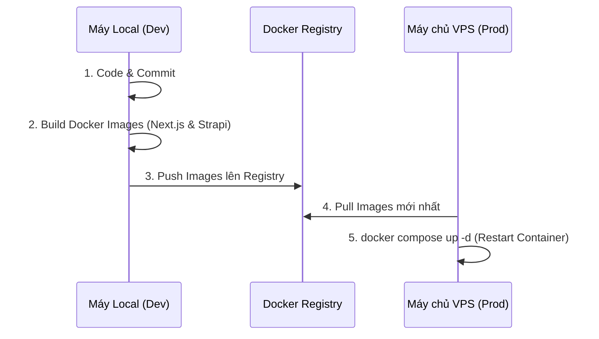

# 🚀 Workflow 2: VPS Deployment (Quy trình Triển khai Production)

Tài liệu này hướng dẫn quy trình triển khai LaunchPad CMS lên một máy chủ VPS Production với tiêu chí: **"Zero-Downtime, Zero-Build on VPS"**.
Toàn bộ quá trình build code nặng nhọc sẽ diễn ra tại máy Local, sau đó đẩy lên Private Registry. VPS chỉ làm nhiệm vụ kéo (Pull) Image đã đóng gói về và chạy.

---

## 🏛️ Kiến trúc Triển khai (Architecture)



---

## 💻 Giai đoạn 1: Thao tác tại máy Local

### 1. Đăng nhập vào Private Registry
Bạn cần xác thực máy Local với Registry Server để có quyền đẩy (push) image:
```bash
docker login <REGISTRY_DOMAIN_HOAC_IP>:5000
```
*(Bạn cũng có thể dùng VS Code Task: `🔑 registry: login`)*

### 2. Build và Push Image lên Registry
Sử dụng công cụ đã được tối ưu hóa trong VS Code để thực hiện tự động cả 2 bước Build và Push:
1. Nhấn `Ctrl + Shift + B`
2. Chọn Task: **`🐳 registry: push-all`**
3. Hệ thống sẽ hỏi:
   - **Registry Address**: Nhập địa chỉ của bạn (VD: `registry.domain.com:5000`)
   - **Image Tag**: Nhập tag phiên bản (Sử dụng mặc định là `latest`, hoặc bạn có thể điền mã phiên bản nếu muốn).

---

## 🌐 Giai đoạn 2: Thao tác tại máy chủ VPS

### 1. Chuẩn bị file hệ thống (Chỉ làm lần đầu)
Sử dụng SCP, FTP hoặc Git để sao chép các cấu hình hạ tầng lên VPS:
- File cấu hình: `compose.prod.yml`
- Thư mục SSL & Proxy: `nginx/`
- File biến môi trường: `.env`

### 2. Khởi tạo và Cấu hình file `.env` trên VPS
Thay vì phải copy thủ công và tạo mã bí mật bằng tay, bạn hãy dùng lệnh tự động sau:
```bash
chmod +x scripts/copy-env.sh
./scripts/copy-env.sh . ./next ./strapi
```
*(Script này tự động copy `.env.example` thành `.env` và tạo mã bảo mật ngẫu nhiên mã hóa base64)*

Sau đó, mở file `.env` gốc để cập nhật các thông số quan trọng:
```env
# URL kết nối API cho Frontend
NEXT_PUBLIC_API_URL=https://api.yourdomain.com

# Cấu hình Registry và Phiên bản để Docker Compose biết lấy ảnh nào
REGISTRY_URL=registry.domain.com:5000
IMAGE_TAG=latest  # Mặc định là latest (trùng với tag bạn push)
```

### 3. Đăng nhập Registry trên VPS
VPS cũng cần xác thực để kéo Image về:
```bash
docker login registry.domain.com:5000
```

### 4. Triển khai Hệ thống (Pull & Run)
Tại thư mục chứa file `compose.prod.yml` trên VPS, chạy 2 lệnh sau:
```bash
# Tải các image mới nhất theo IMAGE_TAG
docker compose -f compose.prod.yml pull

# Khởi động lại hệ thống ngầm, tự động thay thế container cũ
docker compose -f compose.prod.yml up -d
```

> **🌐 Cấu hình Domain & Nginx:** Sau khi hệ thống chạy lên thành công, container Nginx của CMS sẽ lắng nghe ở cổng `8000`. Bạn cần thiết lập Nginx UI trỏ domain về cổng này. 
> 📄 **Xem hướng dẫn chi tiết tại:** [docs/vps-nginx-proxy.md](./vps-nginx-proxy.md)

### 5. Tắt chế độ Seed Data (Quan trọng)
Nếu biến `SEED_DATA=true` đang bật, Strapi sẽ reset lại toàn bộ Database mỗi khi khởi động lại. Sau lần chạy đầu tiên thành công, bạn **BẮT BUỘC** phải tắt nó đi. 

Vì VPS không cài Node.js, hãy sử dụng Bash Script cực nhẹ đã chuẩn bị sẵn:
```bash
chmod +x scripts/toggle-seed.sh
./scripts/toggle-seed.sh disable
```
(Chạy lệnh trên xong, bạn sẽ thấy `SEED_DATA=false` trong file `.env`)

---

## 🔄 Quy trình Cập nhật (Update / Rollback Workflow)

Khi bạn có tính năng mới cần update lên VPS, đây là vòng lặp bạn sẽ thao tác:

1. **Local:** Push code mới lên Registry (để mặc định tag là `latest` hoặc điền tên tag nếu muốn test).
2. **VPS:** Nếu dùng tag khác `latest`, mở file `.env` và sửa `IMAGE_TAG=...`. Nếu dùng `latest` thì giữ nguyên.
3. **VPS:** Chạy lệnh cập nhật:
   ```bash
   docker compose -f compose.prod.yml pull
   docker compose -f compose.prod.yml up -d
   ```

**🚑 Rollback (Khi bản update bị lỗi):**
Nếu bạn cẩn thận push image bằng các tag phiên bản (VD: `v1.0.0`), bạn chỉ cần mở file `.env` trên VPS, đổi `IMAGE_TAG` về phiên bản cũ, và chạy lại lệnh Pull + Up. Hệ thống sẽ lập tức quay về trạng thái ổn định!

---

## 🛡️ Best Practices & Bảo mật

- **Không build trên VPS:** Các lệnh `yarn install` và `yarn build` ngốn rất nhiều CPU/RAM. Nếu build trên VPS 1GB RAM, server gần như chắc chắn sẽ bị đứng/treo máy.
- **Bảo mật cổng (Ports):** Trong file `compose.prod.yml`, Next.js và Strapi KHÔNG ĐƯỢC mở port ra ngoài Host (Xóa phần `ports: - '3000:3000'`). Chúng chỉ giao tiếp qua mạng Docker ảo, người dùng chỉ có thể truy cập qua Nginx (Port 80/443).
- **Healthcheck & Khởi động tuần tự:** Đã được thiết lập sẵn trong file yml, Next.js sẽ kiên nhẫn đợi Database và Strapi báo cáo `Healthy` rồi mới khởi động, loại bỏ hoàn toàn lỗi Crash 500 lúc deploy.
