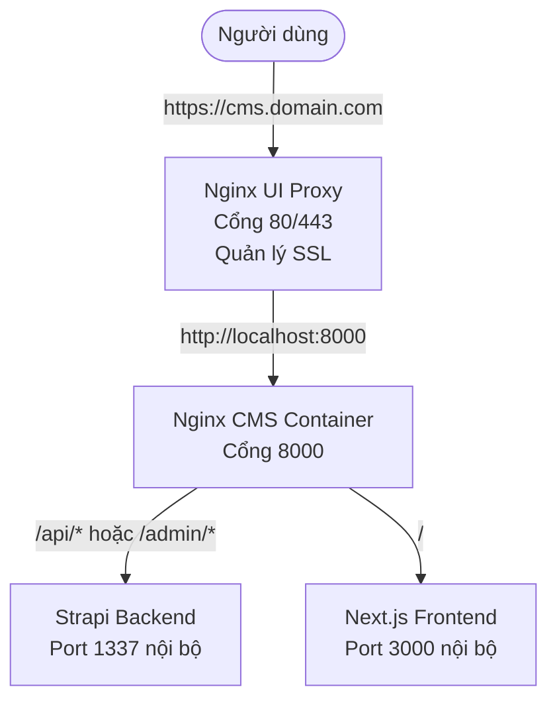

# 🌐 Cấu hình Nginx Reverse Proxy (VPS)

Khi triển khai LaunchPad CMS lên VPS bằng `docker-compose.prod.yml`, một container `nginx` sẽ được khởi tạo đi kèm để làm nhiệm vụ Reverse Proxy chia tải nội bộ cho Next.js và Strapi. 

Tuy nhiên, thay vì chiếm dụng cổng `80` và `443` của hệ thống, container Nginx này được cấu hình đẩy ra cổng `8000`. Điều này cho phép hệ sinh thái DevOps (chạy Nginx UI) có thể làm Proxy cấp 1, nhận request từ Domain và đẩy vào cổng `8000`.

---

## 🏗️ Sơ đồ Request (Luồng dữ liệu)

---

## ⚙️ Hướng dẫn Cấu hình trên Nginx UI

Sau khi bạn đã chạy lệnh `docker compose -f docker-compose.prod.yml up -d` thành công trên VPS, hãy làm theo các bước sau để cấu hình domain cho website của bạn:

1. Đăng nhập vào **Nginx UI** (Bảng điều khiển Nginx của hệ sinh thái DevOps).
2. Vào mục **Sites** -> Nhấn **Add Site**.
3. Điền các thông số cơ bản:
   - **Server Name:** Điền domain của bạn (VD: `cms.domain.com`).
   - **Listen:** `80`.
4. Trong phần cấu hình chi tiết (Locations), tạo cấu hình proxy chuyển tiếp toàn bộ traffic về port 8000:
   - **Path:** `/`
   - **Proxy Pass:** `http://127.0.0.1:8000` (Hoặc địa chỉ IP của VPS nếu 127.0.0.1 không hoạt động do khác biệt Docker Network).
   - **Host:** Bật tùy chọn "Preserve Host" (`$host`).
5. **Cấu hình SSL (Tự động gia hạn HTTPS):**
   - Chuyển sang tab SSL.
   - Nhấn **Enable SSL** và chọn **Let's Encrypt**.
   - Điền Email và nhấn **Issue** để hệ thống tự động sinh chứng chỉ HTTPS.
6. Nhấn **Save & Reload**.

---

## 🔒 Tại sao lại làm theo cách này?

- **Tránh xung đột cổng:** Bạn có thể chạy bao nhiêu dự án (Next.js, React, Node.js...) trên cùng một VPS tùy thích, mỗi dự án map ra một cổng riêng biệt (8000, 8001, 8002...) mà không bị báo lỗi `address already in use`.
- **Quản lý SSL tập trung:** Tất cả chứng chỉ SSL của mọi domain đều được Nginx UI quản lý và tự động gia hạn (auto-renew), CMS không cần bận tâm về việc gắn file chứng chỉ.
- **Bảo mật tối đa:** Strapi và Next.js hoàn toàn ẩn mình trong mạng Docker ảo, không mở bất kỳ port nào ra ngoài internet. Hacker không thể bypass Nginx Proxy để tấn công trực tiếp.
